 <picture></picture> About me

<!-- GIF HEADER -->

<!-- VISTAS DEL PERFIL -->

  

 <h2> Connect with me  </h2>

  
  
  
  

---

 <picture>   </picture> Github Stats

 

  
  

  

<h2 align="left"> Skills  </h2>

<!-- Row 1 -->

<!-- Row 2 -->

  

<!-- Row 3 -->

<!-- Row 4 -->

<!-- Row 5 -->

🏆 GitHub Trophies

 
  
--------
Last Updated on 26/09/2025 02:39:52 UTC
<!--END_SECTION:waka-->

  
  

---------
 
  

💳 Github Profile Summary Card
 

   

 

<!-- GIF FOOTER -->

<!-- RAINBOW LINE BOT -->

