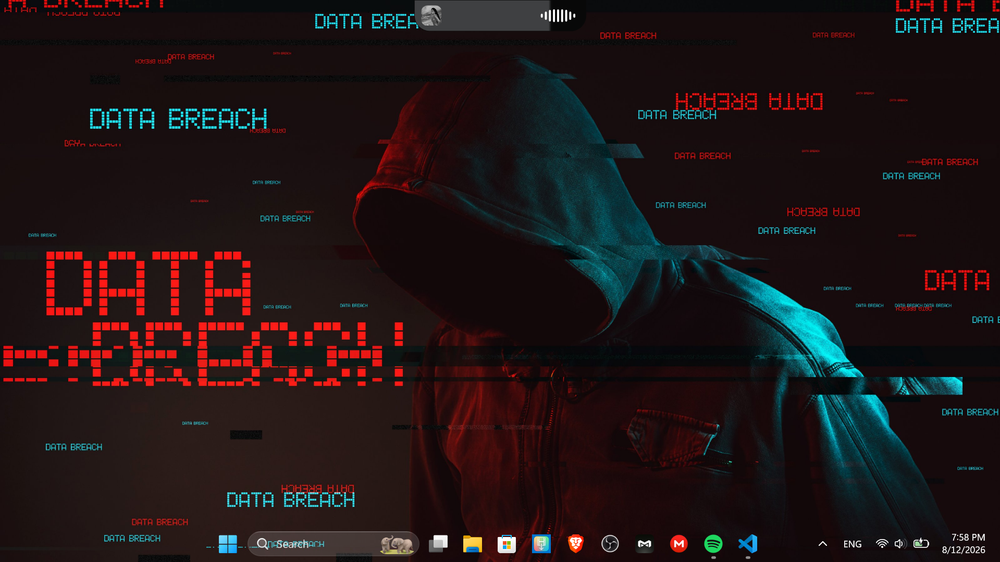

<div align="center">


<br/>


<br/>

<a href="https://github.com/Ahmedcyber2112">

</a>
<a href="https://www.linkedin.com/in/ahmed-soliman-2112ip/">

</a>
<a href="mailto:ahmedso6789@gmail.com">

</a>

<br/><br/>


</div>

---

# 👨‍💻 About Me

I'm **Ahmed Soliman**, a **Full-Stack Developer & Web Security Engineer** focused on building modern, scalable, and secure web applications.

I combine **frontend engineering, backend architecture, databases, APIs, and security** to turn ideas into production-ready systems.

```text
Frontend     → React • Next.js • TypeScript
Backend      → Node.js • Express • NestJS • .NET Core
Databases    → MongoDB • PostgreSQL • MySQL • SQL Server
Architecture → REST APIs • MVC • Clean Architecture • RBAC
Security     → JWT • Authentication • Authorization • API Security
DevOps       → Docker • GitHub Actions • Linux • Vercel
```

<div align="center">

### `BUILD  •  SECURE  •  SCALE`

</div>

---

# 🛠️ Tech Stack

<div align="center">

### Frontend


<br/><br/>

### Backend


<br/><br/>

### Database & DevOps


</div>

---

# 🔥 Featured Projects

### 🏛️ Egyptian Heritage — VR & 3D Platform

Immersive digital experience for exploring **Egyptian artifacts through interactive 3D/VR technology**.

`React` `Node.js` `3D/VR` `REST APIs` `n8n`

---

### 🎓 University E-Learning Platform

Full-stack **Learning Management System** with dedicated dashboards and role-based access for Students, Instructors, and Administrators.

`React` `Node.js` `Prisma` `Docker` `RBAC`

---

### 🛒 Gemaney — E-Commerce Platform

Scalable e-commerce backend built with modern API architecture, authentication, database management, and CRUD operations.

`C#` `ASP.NET Core` `Web API` `SQL Server`

---

# 🔐 Security Engineering

<div align="center">



</div>

I approach security as part of the development lifecycle — from architecture to deployment.

```text
Authentication
      ↓
Authorization / RBAC
      ↓
Input Validation
      ↓
Secure API Design
      ↓
Data Protection
      ↓
Vulnerability Analysis
```

**Security Focus:**
`JWT` · `Authentication` · `Authorization` · `API Security` · `Secure Architecture`

---

# 📊 GitHub Analytics

<div align="center">


<br/><br/>


</div>

---

# 🎓 Professional Development

* 🎓 **Software Developer — Digital Egypt Pioneers Initiative (DEPI R3)**
* ⚙️ **.NET Development Diploma**
* ⚛️ **React & MERN Stack Training**
* 🖥️ **ASP.NET MVC Internship — ITI**
* 🔐 **Cybersecurity Foundations**

---

# 🌐 Connect

<div align="center">

<a href="https://www.linkedin.com/in/ahmed-soliman-2112ip/">

</a>

   

<a href="mailto:ahmedso6789@gmail.com">

</a>

   

<a href="https://github.com/Ahmedcyber2112">

</a>

</div>

<br/>

<div align="center">

### `SECURE THE CODE. BUILD THE FUTURE.`


<br/><br/>


</div>
